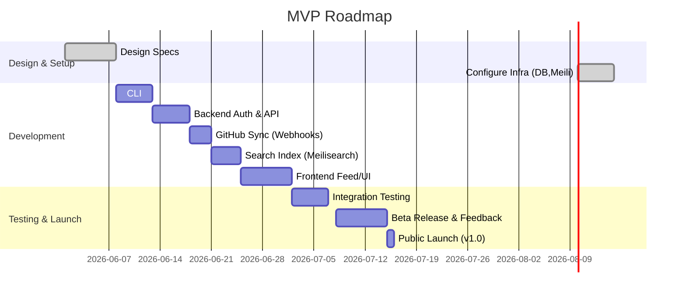

# MVP Checklist

- **Setup GitHub OAuth:** Allow users to sign in via GitHub (tokens only, no passwords).  
- **Minimal Data Model:** User table (id, GitHub handle, token) in Postgres/Supabase; no startup content stored in DB.  
- **CLI (`startup`):** Build core commands: `init`, `login`, `push`, `status`. Support `--auto` to detect project info.  
- **GitHub Sync:** On `startup push`, CLI commits/updates `startup.yml` in user's GitHub repo; add a webhook or Action to notify our API.  
- **Parse Content:** Backend API fetches `startup.yml` from GitHub (via GitHub API) and builds startup profiles.  
- **Search Index:** Deploy Meilisearch; index startups (name, description, tech, tags) for fast search.  
- **Public Feed & UI:** Build a Next.js frontend (host on Vercel/Netlify free) listing startups (filters, categories, trending).  
- **Assets:** Integrate Cloudinary (free plan: 25 GB storage, 25k monthly operations) or Cloudflare Images (5k transforms/month) for logos.  
- **Testing:** Write unit tests for CLI, API; end-to-end tests for flows (register login, push startup, display page).  
- **Launch:** Deploy MVP (invite early adopters); monitor metrics (signups, stars, feedback).  

---

# Project Vision & Tagline

A **Git-driven, developer-first Startup Network** where founders *“ship”* their startup profile from the terminal. Think **“GitHub Pages for Startups”**: a README-like page for every startup, kept in Git, automatically synced via CLI. No clunky dashboards – developers fill out a `startup.yml` and `README.md`, push it, and their startup is live in a public feed. 

> **Tagline:** *“Ship your startup profile from the terminal – GitHub-powered Startup Network.”*

---

# Target Users & Personas

- **Indie Developers & Makers:** Developers building side projects who love Git and CLI. They want a frictionless way to publicize a new startup and find co-builders.  
- **Technical Founders:** CTOs and founder-engineers launching MVPs. They prefer code-based workflows (GitHub, CLI) over web forms.  
- **Open-Source Enthusiasts:** Tech-savvy users who value open-data and contributions. They appreciate a pull-request/CLI-driven system and want their startup to be discoverable by dev communities.  
- **Startup Recruiters & Collaborators:** Engineers looking to join early-stage startups. They search by tech stack or “looking for contributors.”  

*Persona example:* “Anjali is a full-stack dev launching an AI SaaS MVP. She lives in VSCode and GitHub; she loves writing code, not messing with CMS forms. With our CLI, Anjali simply runs `startup init`, fills the YAML, and pushes; a page appears with her project details. She’s thrilled to find early beta users through the feed.”  

---

# Core Features

- **CLI Commands (Terminal first):**  
  - `startup login`: Auth via GitHub (OAuth or personal token) and store credentials.  
  - `startup init`: Generate `startup.yml` and `README.md` templates. `--auto` flag auto-populates fields by scanning `package.json`, Dockerfile, etc.  
  - `startup push`: Commit and push local `startup.yml` (and images via a CLI upload command) to the user’s GitHub repo. Then call our API or rely on webhook to trigger indexing.  
  - `startup status`: Show what changes are pending (like Git status for your startup profile).  
  - `startup list|search`: (Optional CLI) Query the network for startups (e.g. `startup search react`).  

- **GitHub Connect & Sync:**  
  - **OAuth Login:** Users authenticate with GitHub (no password stored) to grant write access.  
  - **User-Owned Repo:** Each user hosts `startup.yml` (and optional `README.md`) in a dedicated GitHub repo (e.g. `username/startup-profile`). The CLI can create or update it. The user owns the data.  
  - **Webhooks/Actions:** On push to the repo (e.g. when `startup.yml` changes), a GitHub webhook or Action calls our backend API (`/api/sync`) to re-fetch and index the profile. (Alternatively, the CLI can POST the YAML to our API directly.)  

- **Auto-Detect Stack & Stats:**  
  - Parse common files (e.g. `package.json`, `requirements.txt`, `Dockerfile`) to auto-fill tech stack or project name on `--auto init`.  
  - Optionally show GitHub repo stats (stars, forks, languages) on the public profile.  

- **Image Upload Flow:**  
  - `startup upload <file>` CLI command: uploads a logo/hero image to Cloudinary (free tier 25 GB) or Cloudflare Images (free: 5k transformations, 10 MB per image) and returns a CDN URL.  
  - The `startup.yml` references image URLs (logo, banner).  

- **Public Feed & Discovery:**  
  - **Home Feed:** A grid or list of startup “cards” (logo, name, tagline, short description, status, tags). Clicking a card opens the full profile.  
  - **Categories & Filters:** Filter by “Looking For: contributors/beta-testers/cofounders”, by tech stack, region, status (MVP, launched), etc.  
  - **Search:** Full-text search across name, description, and tech tags. Uses an engine like Meilisearch (open-source) for instant, typo-tolerant search.  
  - **Trending & Highlights:** Sections for “New”, “Updated Recently”, “Popular (most stars/views)”.  

- **Profile Pages:**  
  - Auto-generated from `startup.yml` (and `README.md`). Fields: Name, Logo, Tagline, **Description** (Markdown), **Tech Stack**, **Roadmap/Updates**, **Looking For** list (e.g. contributors, beta users, co-founder), **Links** (GitHub, website, social).  
  - Version control: Each change to `startup.yml`/README updates the page. History is in Git.  
  - Like GitHub profile pages, but for startups: e.g. `startup.dev/username` or `startup.dev/slackify`.

---

# Data Model & Content Format

- **Database (Users only):** We only store user accounts (GitHub ID, username, OAuth token, preferences) in Postgres (e.g. via Supabase, free tier). *We do NOT store startup content in our DB.*  
- **Git Content (Startup Data):** Each startup is defined by Git files in the user’s repo:  
  - `startup.yml` (YAML frontmatter) with fields like `name`, `tagline`, `status`, `looking_for`, `tech`, `links`, etc.  
  - `README.md` (Markdown) for a detailed description or updates/changelog (optional).  
  - `.startuprc` (config, optional) to save meta info for the CLI (default branch, repo name).  

**Example `startup.yml`:**  
```yaml
name: NovaEdge Academy
tagline: AI-powered learning platform for coders
status: building
looking_for:
  - beta-users
  - contributors
tech:
  - Next.js
  - Node.js
  - PostgreSQL
  - TypeScript
links:
  github: amitkumarraikwar/novaedge-academy
  website: https://novaedge.com
description: >
  NovaEdge Academy is an **AI-driven** platform that creates personalized
  coding curricula. It auto-generates tutorials and quizzes based on user goals.
logo: https://res.cloudinary.com/demo/image/upload/v1/logo.png
```

**Example `README.md`:** *(Optional detailed bio)*  
```markdown
# NovaEdge Academy 🚀

NovaEdge Academy helps developers learn with AI-tailored courses. Built during IndieHackers 2026.  

**Updates:**  
- *Jan 2026*: MVP launched.  
- *Mar 2026*: Added Kotlin course content.  
- *Jun 2026*: Serving 500 monthly users.  

Visit [novaedge.com](https://novaedge.com) to sign up for the beta!
```

**Example `.startuprc`:** (for CLI config, not public)  
```json
{
  "repo": "novaedge-profile",
  "branch": "main",
  "token": "<hidden>"
}
```

*(We may keep `.startuprc` in the user’s home or project folder to store default repo/branch so the CLI doesn’t ask each time.)*

---

# API Design

We’ll expose a JSON REST API for the frontend and CLI integration. Key endpoints:

- **Auth:** 
  - `POST /api/auth/github`: GitHub OAuth callback (or CLI login with token). Returns JWT or session.
  - `GET /api/me`: Returns current user profile (GitHub username, avatar, linked repos).

- **Startup Profiles:**  
  - `GET /api/startups`: List all startups (with pagination). Supports query params for search/filter (e.g. `?q=react&looking_for=contributors`).  
  - `GET /api/startups/:slug`: Get full profile JSON of a startup.  
  - `POST /api/startups/:slug/sync` (or `PUT`): Trigger re-sync of a startup (protected: can only be called by the owner via webhook or API key).  
  - *(No public write: startups are updated via Git pushes and webhooks, not direct API create.)*  

- **Search:**  
  - `GET /api/search?q=...`: Proxy to Meilisearch queries, returning matching startups.

- **Tags/Categories:**  
  - `GET /api/categories`: List available filters (tech tags, locations, etc) for the UI.

- **Webhook Receiver:**  
  - `POST /api/webhook/github`: Endpoint for GitHub webhooks (configured by user) to receive push events. It calls the sync logic for that user’s startup.

**Authentication:** Use GitHub OAuth tokens or our own JWT after OAuth. Each user’s token is used to fetch their private data (GitHub repo). Rate-limit API (e.g. 100 req/min) to prevent abuse.  Use HTTPS and validate webhooks with a secret.

**Sample API Response:** `GET /api/startups/novaedge-academy`  
```json
{
  "name": "NovaEdge Academy",
  "slug": "novaedge-academy",
  "tagline": "AI-powered learning platform for coders",
  "description": "NovaEdge Academy helps developers learn with AI-tailored courses...",
  "status": "building",
  "looking_for": ["beta-users", "contributors"],
  "tech": ["Next.js", "Node.js", "PostgreSQL", "TypeScript"],
  "links": {
    "github": "amitkumarraikwar/novaedge-academy",
    "website": "https://novaedge.com"
  },
  "logo": "https://res.cloudinary.com/demo/image/upload/v1/logo.png",
  "updates": [
    {"date": "2026-01-01", "note": "MVP launched"},
    {"date": "2026-03-15", "note": "First user signup"}
  ],
  "updated_at": "2026-06-18T10:00:00Z"
}
```

---

# CLI UX Specification

The `startup` CLI should be intuitive (inspired by tools like `git` or `vercel`):

- **Installation:** Via npm or pip (choose Node.js: e.g. `npm install -g startup-cli`).  
- **`startup login`**: Prompts the user to authenticate with GitHub (opens browser for OAuth or accepts a personal token). Stores a local config or `.startuprc`.  
- **`startup init [--auto]`**: Creates `startup.yml` (and `README.md` stub) in current directory. 
  - With `--auto`, auto-detects project info (uses current folder name as slug, reads `package.json` to suggest name/tech).  
  - Example interaction:
    ```bash
    $ startup init --auto
    Detected project name "novaedge-academy". Use this as slug? (Y/n) Y
    Detected tech stack: Next.js, Node.js. (Y/n) Y
    Startup profile created: startup.yml
    ```
- **`startup push`**: Commits and pushes `startup.yml` (and `README.md` if new) to the GitHub repo (creating the repo if needed). Then calls the API to update the network.
  - Example: `$ startup push` → “Pushing to GitHub... ✓ Startup profile updated.”  
- **`startup upload <file>`**: Uploads an image (logo or banner) to Cloudinary and returns URL (automatically inserting into `startup.yml` if named properly).  
- **`startup sync`**: Manually trigger a pull from GitHub and re-index (calls our `/api/sync`). Useful if webhooks fail.
- **`startup list/search <query>`**: (Optional CLI command) Query the public network for startups (e.g. search by tech). Returns console table of results.

**Flags and config:**  
- `--repo <name>`: specify GitHub repo name (if not in current).  
- `--branch <name>`: specify branch (default `main`).  
- `--token <token>`: use a GitHub token via CLI.  

Use a library like [oclif](https://github.com/oclif/oclif) or [Commander.js](https://github.com/tj/commander.js) for CLI parsing. Follow Node.js CLI best practices (clear help text, exit codes).

---

# GitHub Action & Webhook Flows

We support two GitHub-driven sync methods:

- **GitHub Action (recommended):** The user adds a provided Action workflow to their repo. On each push to `startup.yml` (or the branch), the Action script calls our API:
  ```yaml
  name: Sync Startup Profile
  on:
    push:
      paths: ['startup.yml']
  jobs:
    notify:
      runs-on: ubuntu-latest
      steps:
        - name: Call Startup Network API
          uses: actions/github-script@v6
          with:
            script: |
              await fetch('https://api.startuphub.dev/sync', {
                method: 'POST',
                headers: { 'Content-Type': 'application/json' },
                body: JSON.stringify({
                  owner: context.repo.owner,
                  repo: context.repo.repo,
                  path: 'startup.yml',
                  event: 'push'
                })
              });
  ```
- **GitHub Webhook:** The user can alternatively set a webhook URL (`https://api.startuphub.dev/webhook`) in their repo settings (configured via our site after login). On any push, GitHub POSTs JSON payload. We verify signature and then fetch `startup.yml`.

**Flow:**  
1. Developer edits `startup.yml` locally.  
2. `startup push` commits/pushes to GitHub.  
3. GitHub triggers Action or webhook to `/api/sync`.  
4. Our backend uses GitHub API to retrieve the file contents (optionally along with `README.md` and images).  
5. Update search index and cache; regenerate the public profile page (could be static regenerate or server-render).  

This ensures the Git repo is the source of truth. Even if our service goes down, the data lives in Git.

---

# Storage & Assets

We must serve static assets (logos, images) on a free CDN:

| Service              | Type        | Free Plan                        | Notes |
|----------------------|-------------|-----------------------------------|-------|
| **Cloudinary**       | SaaS (CDN)  | Free: 25 GB storage, 25k transformations/month | Built for media management, easy to use. Add SDK for upload. |
| **Cloudflare Images**| SaaS (CDN)  | Free: 5,000 transformations/month; 10 MB/image limit. | Good if already on Cloudflare; paid adds storage. |
| **Imgix**            | SaaS (CDN)  | Free trial; not truly free after. | High-quality, but not open/free beyond trial. |
| **GitHub (raw)**     | CDN         | Unlimited static files, but no transformations. | Could use for images (via `raw.githubusercontent.com`), but lacks resizing. |
| **AWS S3 (free tier)**| Cloud Storage| 5 GB standard free for 12 months; 15GB egress free. | Requires account; bandwidth beyond free is costly. |
| **Netlify Large Media**| SaaS      | Integrated with Netlify; no cost for small usage. | Hard to manage outside Netlify workflow. |
| **Uploadcare/Filestack**| SaaS      | Limited free/trial; proprietary. | Likely not needed if Cloudinary covers. |

**Recommendation:** Use **Cloudinary** for logo uploads. Its free tier (25 GB storage) is generous enough for a directory of images. Provide a CLI command to upload to Cloudinary (requires the user to configure an API key). Store only the returned CDN URL in `startup.yml`. Alternatively, allow any public image URL and skip upload. 

We store no images in our DB/servers; all are on a CDN. On the frontend, simply `` the Cloudinary/Cloudflare URL.

---

# Indexing & Search Strategy

To power instant, typo-tolerant search and filters, we’ll run an open-source search engine. Options:

| Search Engine  | Type      | Free/Self-host        | Notes |
|---------------|-----------|-----------------------|-------|
| **Meilisearch**  | Open-source, Rust | Self-host: free (MIT); Cloud plan (free tier) | Focused on front-end search (instant, typo-tolerant, prefix search). Easy setup (Docker or binary). Supports faceted search (tech filters). |
| **Typesense**   | Open-source (Go) | Self-host: free (AGPL) | Similar goals as Meilisearch; good docs. Slightly younger project. |
| **Elasticsearch**| Open-source (Java) | Self-host: free; heavy resource use | Overkill for small to medium data; designed for enterprise log indexing, not instant UX. |
| **Algolia**     | SaaS (closed) | Free: 10k records, 100k search operations (strict) | Lightning-fast, but paid beyond small scale. Meilisearch is *inspired by Algolia* and matches its features, plus it’s open-source. |

Meilisearch is a **strong choice**: it’s MIT-licensed and optimized for user-facing search (fast, typo-correction). We can self-host on any Linux server (Fly.io, Railway) at zero software cost. It also has a free cloud plan for small indexes. 

**Index Fields:** We’ll index `name`, `tagline`, `description`, `tech`, and `looking_for` fields. Also compute a combined `keywords` field for free-text search. Each index document has an `id` = `username/startup-slug`. Store minimal JSON in Meili (just for search results). For actual data, our API will query GitHub or cache as needed.

**Search UI:** On the frontend, query `/api/search?q=...` for autocomplete suggestions. Facets (checkboxes) for `tech` and `looking_for` can be implemented via Meili’s facet filters.

---

# Feed Ranking & Categories

**Feed (“Hacker News-style” list):**  
- **New Arrivals:** Startups most recently added.  
- **Trending / Popular:** Sort by combined metric: page views + GitHub stars + recent updates. E.g. `score = views + (stars * 10) + (updates * 5)`. This biases active projects.  
- **Looking for:** Filtered lists like “Looking for Contributors” (find startups where `looking_for` includes “contributors”). Encourage browse by interest (open source collaboration).  
- **Category Tags:** Predefined categories (e.g. "AI", "EdTech", "FinTech", "Built in India", "Open Source") gleaned from `tech` or additional YAML tags. Could auto-label by tech keywords or allow users to pick from a list.  

**Ranking Logic:** Could combine recency and popularity. E.g.:  
``` 
score = w1*(now - updated_at)^(-1) + w2*(stars) + w3*(has_many_followers) 
```  
(Weighted, time-decay function.) Initially, simple: sort by `updated_at` for “New” and sort by (stars + views) for “Popular”.

Tags like “Built in India” can be a filter: if `location: India` or `country: India` field is in YAML (optional). Otherwise skip.  

For MVP, focus on:
- **Recent Updates:** Show last modified date on cards (e.g. “Updated 2 days ago”).  
- **Tagline & Tech Badges:** Show tech as badges on cards.  
- **Starter Categories:** Let users filter by technology (multi-select) and by “Looking For” status.

---

# Security, Privacy & Ownership

- **Data Ownership:** Users’ startup data lives in their GitHub repos (they own it). We never take ownership of content.  
- **Authentication:** GitHub OAuth (3-legged) or token; we only store tokens (encrypted) for access. If a user revokes GitHub, their content remains on GitHub, and we disable their profile view.  
- **Privacy:** Only public data is shown. If a repo is private, we can't index it (CLI should enforce `repo` is public or handle auth). We encourage public startup repos to increase visibility.  
- **Rate Limits:** API rate-limit to prevent scraping. Use Meili / Supabase/etc safe defaults.  
- **Spam Prevention:** Require GitHub auth to add content, which discourages anonymous spam. Optionally moderate by flagging: allow community to report bad profiles.  
- **Malicious Content:** Sanitization: any Markdown from `README.md` should be sanitized to avoid XSS (e.g. using `rehype-sanitize`). Logos should be served via CDN (reducing risk of malicious images).  
- **HTTPS Everywhere:** All APIs and webhooks over HTTPS. Use GitHub secrets to validate webhooks.  
- **Credentials:** Do not store any sensitive user info (only GitHub ID/username). `.startuprc` tokens should be kept local and not committed.

---

# Tech Stack & Infrastructure (Zero/Budget)

Prefer open-source and free-tier services:

| Component       | Tech Choice      | Free Tier / Cost                    | Notes |
|-----------------|------------------|-------------------------------------|-------|
| **Frontend**    | Next.js/React    | Vercel Hobby (free) or Netlify Free | Host static and SSR. Unlimited projects on hobby; good for global CDN. |
| **Backend (API)**| Node.js (Express or Fastify) | Railway Free: 0.5GB RAM, 0.5GB storage<br>or Vercel Serverless Functions (350k exec/min free) | Simple JSON API. Can use Vercel Functions or a tiny VPS. |
| **Database**    | Postgres (Supabase) | Free: 500MB DB, 1GB storage, 50k MAUs | For user auth info only. Supabase includes Auth, easy. |
| **Search**      | Meilisearch      | Self-host on same VPS (negligible cost) or Meili Cloud free tier | Open-source and fast (ideal for front-end search). |
| **Assets/Images**| Cloudinary      | Free: 25GB storage, transformations | Also acts as CDN. |
| **GitHub OAuth**| GitHub           | Free for public repos; no cost.      | We rely on GitHub for auth and hosting data (free). |
| **CI/CD**       | GitHub Actions or Vercel/CDNs | Free for open-source; GitHub Actions ~2000 minutes/mo free. | Deploy on push to main. |
| **Domain & SSL**| Custom Domain    | ~\$10/year (optional).               | Could use `.dev` TLD; SSL via Let's Encrypt (free). |
| **Monitoring**  | Email alerts/logs| Use free tiers (e.g. Logflare, basic alerts). | Initially manual monitoring (Sentry, Prometheus free). |

Most services above have generous free tiers. For example, **Vercel’s Hobby** plan provides 1,000,000 serverless function calls and 1,000 image optimizations per month, which is ample for a small community. Netlify’s free tier offers 300 usage credits/month (bandwidth/compute). **Railway’s Free plan** (or $1/mo) gives a tiny VM (1 vCPU, 0.5GB RAM), enough for our API and Meilisearch combined if optimized. 

**Database:** Supabase’s free tier (500MB) should suffice for user accounts (likely < 10MB needed). Or use PlanetScale (MySQL) free similar. Using SQLite is also possible for MVP (0 external cost), but multi-instance scaling is hard.

**Deployment:**  
- Frontend on Vercel (Git-integrated, free TLS).  
- Backend on Railway or Fly.io (free credits).  
- Use GitHub Actions to build and test on each push.

---

```mermaid
flowchart TB
  subgraph Local
    Dev[Developer Terminal] --> CLI[(`startup` CLI)]
    CLI --> GHUserRepo[GitHub User Repo<br/>(startup.yml)]
  end
  subgraph Cloud [Startup Network Service]
    GHUserRepo -- GitHub Webhook --> WebhookEndpoint[/api/webhook\ (POST)]
    CLI -- API request --> Backend[Node.js API Server]
    Backend --> DB[(Postgres Users DB)]
    Backend --> Meili[Meilisearch Index]
    Backend --> Srvless[Serverless Frontend]
    Cloudinary[Cloudinary CDN] -.-> Backend
    GHUserRepo -- Raw Fetch --> Backend
  end
  Browser[Web Browser] --> Srvless
  Srvless -- calls --> Backend
```

---

# Timeline (Gantt Chart)



*(Dates are illustrative; adjust as needed.)*

---

# Testing Plan & Launch Checklist

- **Unit Tests:**  
  - CLI: test command parsing and config handling (`startup init` creates correct files).  
  - API: test endpoints (mock GitHub API, ensure correct responses for `/startups` and `/search`).  

- **Integration Tests:**  
  - Simulate a full flow in staging: `startup init`, modify `startup.yml`, `startup push` (to a test repo), trigger webhook, confirm profile appears via API.  
  - UI tests: automate browsing filter and search features.  

- **Security Tests:**  
  - Penetration check: ensure webhooks are secure, no SQL injection, XSS checks on Markdown.  
  - Rate limiting enforced (using tools like Artillery on APIs).  

- **Launch Checklist:**  
  - Domain setup with HTTPS (e.g. `startuphub.dev`).  
  - CI/CD pipelines configured (GitHub Actions building/test/deploy).  
  - Analytics (Basic logs, or lightweight analytics e.g. Plausible).  
  - Documentation drafted (README, CONTRIBUTING).  
  - Social media/announcements prepared.  

- **Success Metrics (MVP):**  
  - 10+ startups added, 100+ user sign-ups in first month.  
  - At least 1 external contribution (PR) to codebase.  
  - Search queries, active daily users of CLI (telemetry via opt-in).  

---

# Contributor Onboarding & Governance

- **Contributing Guide:** Add `CONTRIBUTING.md` in the repo: code style, commit message guidelines, PR process.  
- **Code of Conduct:** Standard CoC for open communities (e.g. Contributor Covenant).  
- **PR Workflow:** Code and documentation via PRs. Tag maintainers for review.  
- **Moderation:** Since startup data lives in user repos, we’re not accepting "startup submissions" via our repo. However, if we implement a central directory repo, it could be PR-based. For content moderation, rely on GitHub identity (no anonymity). Possibly allow community flagging of profiles for admin review.  
- **Issue Tracker:** Separate issues for feature requests vs. bug reports.  
- **Maintainers:** Core team (initial dev(s)), open to co-maintainers from community.  

---

# Licensing

Open-source license: **MIT** is recommended for maximum adoption (permissive, widely used). It allows commercial and open use. Alternatively, **Apache 2.0** adds explicit patent grant, but MIT is simpler.  

Include a LICENSE file and specify in `package.json`. Encourage contributors to sign off on DCO if needed (Developer Certificate of Origin).

---

# Potential Risks & Mitigations

- **Low Adoption:** Without marketing, the network might stay small. *Mitigation:* Engage developer communities, blog posts, social media.  
- **Content Spam:** Users could insert irrelevant or abusive content. *Mitigation:* GitHub login requirement; allow "report" button; remove flagged profiles.  
- **GitHub API Limits:** Many syncs could hit API rate limit. *Mitigation:* Cache results, use conditional requests (`ETag`), batch syncs during low activity, leverage user’s GH token for increased quota.  
- **Service Reliance:** If Cloudinary or Meilisearch has downtime, images or search fail. *Mitigation:* Default to original image URL if Cloudinary fails; allow fallback search via simple filtering. Use high-quality free services known for reliability.  
- **Unauthorized Access:** If tokens leak, malicious updates possible. *Mitigation:* Store tokens encrypted, allow users to revoke. Use GitHub’s own OAuth security.  
- **Scalability:** Unlikely to hit scale early; if it grows, might need stronger infra (shard Meili, more DB replicas). Keep architecture modular to scale later.  

---

# Growth & Adoption Tactics

- **Developer Communities:** Post on Hacker News, Indie Hackers, Reddit (`r/webdev`, `r/node`, `r/startups`), Twitter/X (with dev hashtags). Demonstrate CLI-first approach as novelty.  
- **GitHub Marketplace:** Once stable, publish the CLI or GitHub Action in GitHub Marketplace (free listing).  
- **Showcase Integrations:** Write blog/tutorial on “Ship your startup from the CLI” to attract coders.  
- **Partnerships:** Reach out to tech startup accelerators or dev event organizers to share tool.  
- **Integrate with Tools:** Slack bot for alerts when a startup adds new update; RSS feeds for categories.  
- **Feedback Loops:** Use feedback form/Discord to get feature requests from early users (iterative dev).  

Emphasize that this tool scratches a familiar itch for devs: GitHub is already the largest “startup directory” out there, so a dedicated network leverages developer habits. Even just curiosity and the “cool-factor” of a CLI dashboard should drive initial signups.

---

# Appendices

## Example YAML/Markdown Files

```yaml
# startup.yml
name: SkillSwap
tagline: Skill-sharing marketplace for coders
status: launched
looking_for:
  - mentors
  - cofounders
tech:
  - React
  - Firebase
  - Docker
links:
  github: jsnow/skillswap
  website: https://skillswap.org
description: >
  SkillSwap is a P2P platform for coding skill exchange. Connect, teach, and learn!
logo: https://res.cloudinary.com/demo/image/upload/v1/skillswap.png
```

```markdown
<!-- README.md -->
# SkillSwap 🎓

SkillSwap connects developers to learn from each other. We’ve onboarded 1000+ users since launch!  

**Contact:** [@jsnow](https://twitter.com/jsnow) | [Join Discord](https://discord.gg/example)

**Release notes:**  
- *2026-05-10*: Launched web platform.  
- *2026-06-05*: API v2 with Docker support.
```

## Sample API Requests

- **Search startups:** `GET /api/search?q=react&looking_for=contributors`  
- **Get profile:** `GET /api/startups/amitkumarraikwar` returns JSON like above.  

## Infrastructure Comparison Tables

**Search Engine Options:**

| Engine        | License        | Hosting      | Free Tier/Limit                       | Notes |
|---------------|----------------|--------------|---------------------------------------|-------|
| **Meilisearch** | MIT (OSS)      | Self-host/Docker | Unlimited self-host; Cloud Tier (free 20k docs) | Fast, typo-tolerant, instant search. Great for user-facing search. |
| **Typesense**   | AGPL (OSS)     | Self-host/Docker | Unlimited self-host (AGPL); Cloud has free eval | Very similar to Meili (also Algolia-inspired). Slightly less mature community. |
| **Elasticsearch**| Apache (OSS)  | Self-host      | Unlimited self-host; Elastic Cloud free trial | Heavyweight, not optimized for instant UI search; overkill for <100k docs. |
| **Algolia**     | Proprietary    | SaaS           | 10k records, 100k queries free (Starter) | Very polished, but closed & paid beyond small scale. |

**Image Hosting Options:**

| Service           | Type        | Free Tier                                | Limitations                     |
|-------------------|-------------|------------------------------------------|---------------------------------|
| **Cloudinary**    | SaaS/CDN    | 25 GB storage, 25k transformations free | Industry standard; requires signup. |
| **Cloudflare Images** | SaaS/CDN | 5k unique transforms/month; 10 MB/image upload | Free transformations; no persistent storage (unless paid). |
| **GitHub (raw)**  | Static      | Unlimited images via raw.githubusercontent.com | No image processing; no privacy. |
| **AWS S3**        | Cloud Blob  | 5GB storage + 15GB egress first 12mo  | Need AWS account; fees after free tier. |
| **Netlify Blob**  | SaaS/CDN    | Included in Netlify free (with limits) | Tied to Netlify build process. |

**Hosting/Infrastructure:**

| Component      | Option        | Free Tier / Limit                  | Notes |
|----------------|---------------|------------------------------------|-------|
| **Static Hosting** | Vercel Hobby   | 4 CPU-hrs, 360GB-hrs, 1M invoc, 1000 images | Great for Next.js frontend & SSR. TLS included. |
|                | Netlify Free  | Unlimited deploys; 300 build credits| Good for static + functions (300 build credits). |
| **Backend (Server)** | Railway Free  | 0.5GB RAM, 0.5GB storage, $1/mo credits | Easy, generous free credit. |
|                | Fly.io Free   | 3 shared-cpu-1x VMs, 3GB storage each | Can run Node and Meili on free VM. |
| **Database**   | Supabase      | 500MB Postgres, 1GB storage (free) | Includes auth & REST API. |
|                | PlanetScale   | 5GB MySQL, unlimited branches (free) | Good scaling, but versioning more complex. |
| **Search Index** | Self-hosted Meili | Free (just host it)          | Only cost is server/vm time. |
| **CI/CD**      | GitHub Actions | 2000 min free/month for public repos | Use for tests & deploys. |
| **Auth/OAuth** | GitHub        | Free                                  | Using GitHub for auth also simplifies user setup. |

Each choice emphasizes **no cash outlay**. All selected services have robust free tiers or are self-hostable.

---

By combining Git-powered content (in user repos), a friendly CLI, and modern open tools (Meilisearch, Cloudinary, Supabase, Vercel), we build a **zero-budget, dev-friendly Startup Network**. It lets founders work in familiar tools (code & terminal) while automating visibility via a public feed. Over time, with open contributions and community buzz, this can grow into a thriving hub for bootstrapped tech projects. 

**Sources:** Meilisearch documentation (search engine choice), Cloudinary pricing, Supabase pricing, Vercel Hobby limits, Cloudflare Images pricing, and related tech docs.

## MVP Definition

A user should be able to:

1. Login
2. Create startup.yml
3. Push startup
4. Sync with GitHub
5. Appear in feed
6. Open public startup page
7. Search startup

Only after these 7 work:
- Notifications
- Likes
- Followers
- Comments
- Analytics